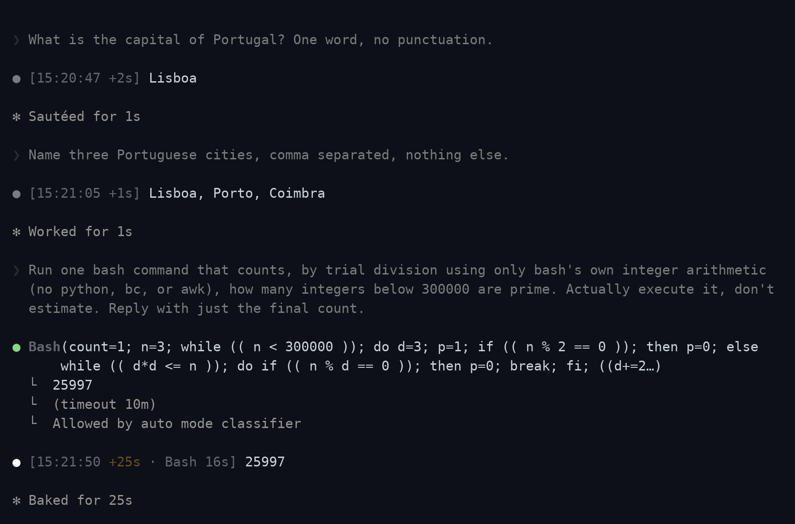

# Claude Timestamp

A Claude Code plugin that puts the local time on every assistant message, shows
how long each turn took, and tells Claude when your prompt was sent.



Two fast turns render dim. The third crossed the slow threshold, so its
duration is coloured.

## What it does

- **Timestamps every message.** A marker like `[13:22:13]` in front of each
  assistant message, in your local time or a timezone you pin.
- **Shows how long a turn took.** `+2m14s` counts from the moment you pressed
  enter to the moment the reply appeared.
- **Highlights slow turns.** Once a turn passes a threshold you set, its
  duration changes colour so you notice it instead of reading past it.
- **Marks where you stepped away.** A gap between messages is labelled, so a
  session you returned to the next morning still reads in order.
- **Tells Claude the time.** The model receives the local time each prompt was
  sent, which lets it reason about when things happened. You can switch this
  off and keep the display-only marker.
- **Summarises the session.** On exit: how long it ran, how many turns, and how
  much of that you spent waiting. Optionally which tools were slowest.

Display is display only. The marker is drawn as messages render, so it never
enters the transcript and never reaches the model.

## Requirements

`jq`, and `bash`. That is the whole list. If `jq` is missing the plugin says so
once and then does nothing, rather than failing quietly.

```
macOS           brew install jq
Debian/Ubuntu   sudo apt-get install jq
Windows         winget install jqlang.jq
```

## Install

```bash
claude plugin marketplace add AraneaDev/claude-timestamp
claude plugin install claude-timestamp@aranea-claude-tools
```

Hooks are bound when a session starts, so start a new session before markers
appear. An already-running session will not pick the plugin up.

## Configure

Nothing needs configuring. The defaults work, and the plugin tells you where to
change them on first run.

To change something, run `/timestamps` inside Claude Code and answer the
questions. For an interactive wizard with a live preview instead, run the setup
script in a terminal, where it has a real TTY:

```bash
bash "$CLAUDE_PLUGIN_ROOT/hooks/scripts/setup.sh"
```


Every question shows its current value in brackets, and pressing enter keeps
it. The colour list and the result line are rendered by the same code that
draws the real marker, so a preview cannot drift from what you will actually
see.

It also takes flags, which is what `/timestamps` uses:

```bash
setup.sh --tz=Asia/Tokyo --display=short --color=dim --slow-after=30
```

Every flag is optional and anything you leave out keeps its current value.

### Settings

Configuration lives in `~/.claude/claude-timestamp.conf` as `KEY=value`. It is
parsed against a list of known keys and never executed, so a stray line in it
cannot run anything.

| Setting | Default | What it does |
| --- | --- | --- |
| `TZ` | machine local | IANA name such as `Europe/Amsterdam`, or empty for local time |
| `DISPLAY_FORMAT` | `24h` | `24h`, `short`, `12h`, `iso`, or any strftime string |
| `CONTEXT_FORMAT` | `24h` | Same values, for the time Claude is told |
| `COLOR` | `dim` | `none`, `dim`, `gray`, `red`, `green`, `yellow`, `blue`, `magenta`, `cyan` |
| `ELAPSED` | `on` | Show how long the turn took |
| `INJECT_CONTEXT` | `true` | Tell Claude the local time each prompt was sent |
| `SLOW_AFTER` | `60` | Colour the duration past this many seconds, `0` disables |
| `SLOW_COLOR` | `yellow` | Colour used for a slow turn |
| `IDLE_AFTER` | `3600` | Mark a gap this long between messages, `0` disables |
| `DATE_ROLLOVER` | `on` | Show the date on the first message after midnight |
| `SUMMARY` | `on` | Report session totals on exit |
| `SUBAGENTS` | `on` | Stamp subagent messages as well |
| `TOOL_TIMING` | `off` | Time individual tool calls and name the slowest |

`NO_COLOR` disables colour regardless of `COLOR`.

Clock formats render as `14:03:22` for `24h`, `14:03` for `short`, `2:03 PM`
for `12h`, and `2026-08-19T14:03:22` for `iso`. Any value containing a `%` is
treated as a strftime string, so the escape hatch needs no separate setting.

`TOOL_TIMING` is off by default because it is the only setting that costs
anything per tool call. Everything else costs once per message.

## When something is wrong

```bash
bash "$CLAUDE_PLUGIN_ROOT/hooks/scripts/setup.sh" --doctor
```


It checks that `jq` is present, that the config parses, that a pinned timezone
can actually be applied on this machine, and that the state directory is
writable. It exits non-zero if any of that fails.

## How it works

Six hooks, all of them harness-only, so none of this costs model context.

| Hook | Job |
| --- | --- |
| `SessionStart` | Check `jq`, prune old state, point a new user at `/timestamps` |
| `UserPromptSubmit` | Record the turn start, tell Claude the local time |
| `MessageDisplay` | Draw the marker on the first batch of each message |
| `SessionEnd` | Report the summary, clear the session's state |
| `PreToolUse` / `PostToolUse` | Time tool calls, only when `TOOL_TIMING=on` |

`MessageDisplay` fires repeatedly as a message streams. Only the first batch is
stamped, and the rest return nothing at all, which Claude Code treats as "show
the original text". Returning the text unchanged would have meant a wasted
round trip on every batch of every message.

Timing state lives in `$TMPDIR/claude-timestamp`, one small file per session,
cleared when the session ends and pruned after seven days.

## Platform notes

Tested on Linux, macOS and Windows on every push.

Git Bash on Windows ships without a timezone database. `date` there silently
falls back to UTC for any IANA name it cannot resolve, so a pinned zone would
show the wrong time and say nothing. The plugin detects this and uses local
time instead, mentions it once at session start, and refuses to write a pinned
zone it knows cannot be honoured. `UTC` and `GMT` still work, since those need
no database.

Tool timings use sub-second precision where the shell provides it. That needs
bash 5 or newer. macOS still ships bash 3.2 as `/bin/bash`, and BSD `date` has
no `%N`, so there is no portable fallback. On those platforms durations round
to whole seconds and the call counts carry the signal.

## Development

```bash
bash tests/run.sh                                    # 165 assertions, no framework
shellcheck -S style -e SC1091 hooks/scripts/**/*.sh  # clean
bash tools/check-docs.sh                             # README against the code
```

The suite has no dependencies beyond what the plugin itself needs. Each case
resets the config and state directory before it runs, so no test can inherit
anything from the one before it. The interactive wizard is covered too: it
reads answers from stdin when there is no terminal, which makes the whole flow
scriptable without a pseudo-terminal.

`tools/check-docs.sh` catches the ways this README goes stale without anyone
noticing: a setting that is added and never written down, an assertion count
that stops matching the suite, and an image link pointing at a file that has
been renamed.

CI runs on Linux, macOS and Windows. On macOS it runs the suite twice, once
with the default bash and once with `/bin/bash`, which is still 3.2. That is
what keeps the bash 3.2 claim above honest rather than aspirational.

### Screenshots

The images above are regenerated by a script rather than taken by hand:

```bash
bash tools/screenshots/make.sh          # all of them
bash tools/screenshots/make.sh doctor   # just one
```

It drives the real programs, the wizard and doctor through a pty and the hero
shot through an actual Claude Code session, then renders what was painted using
a terminal emulator. Nothing in those images is mocked up. The hero shot
therefore needs a working login and spends tokens, and its durations differ
every run because they are real measurements. Python dependencies install into
a virtualenv beside the script.

## License

MIT
