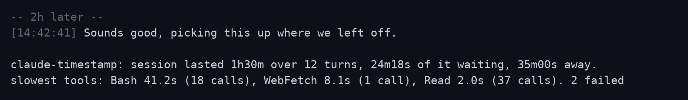
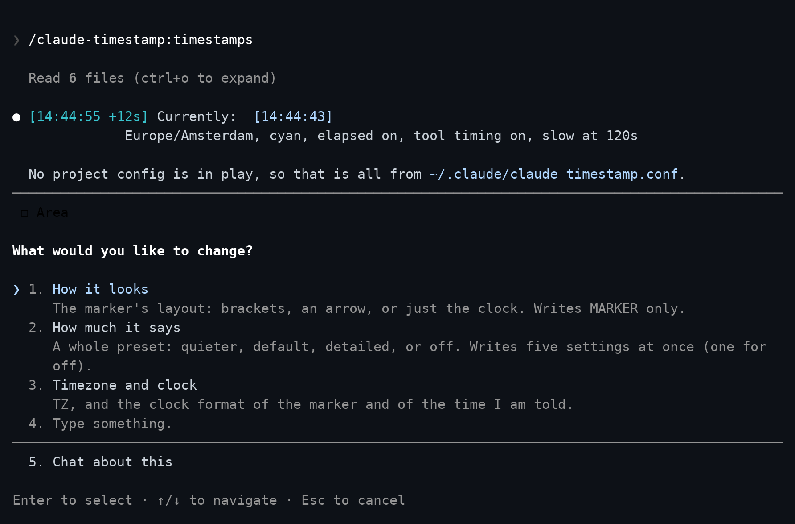
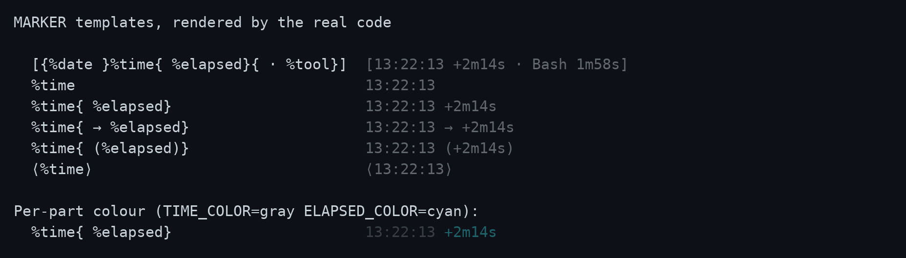
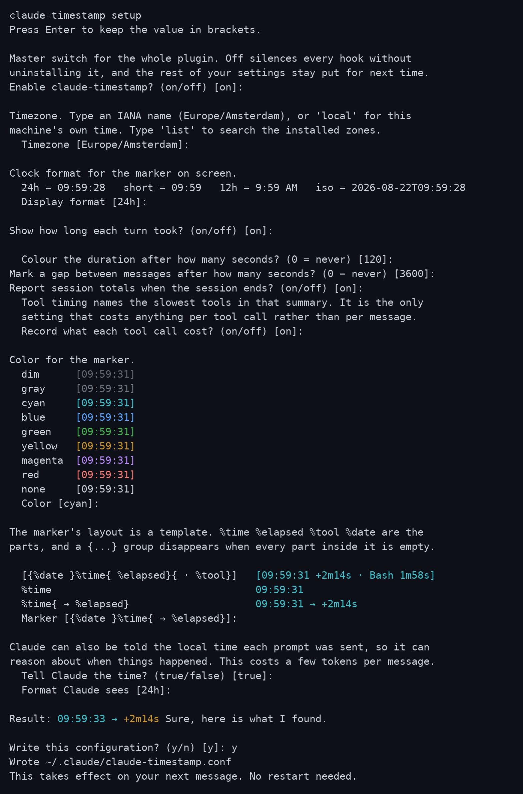
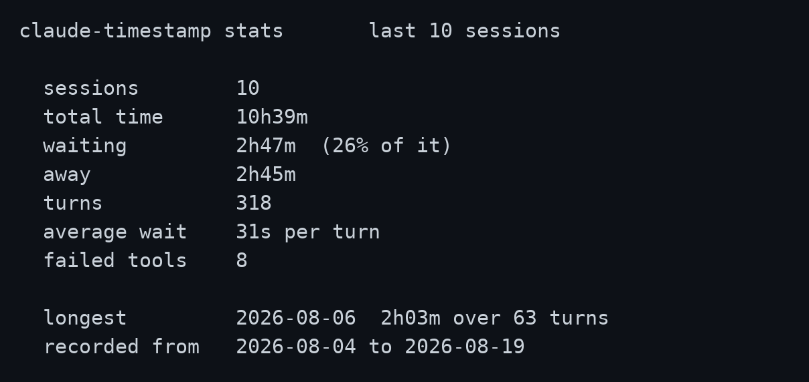
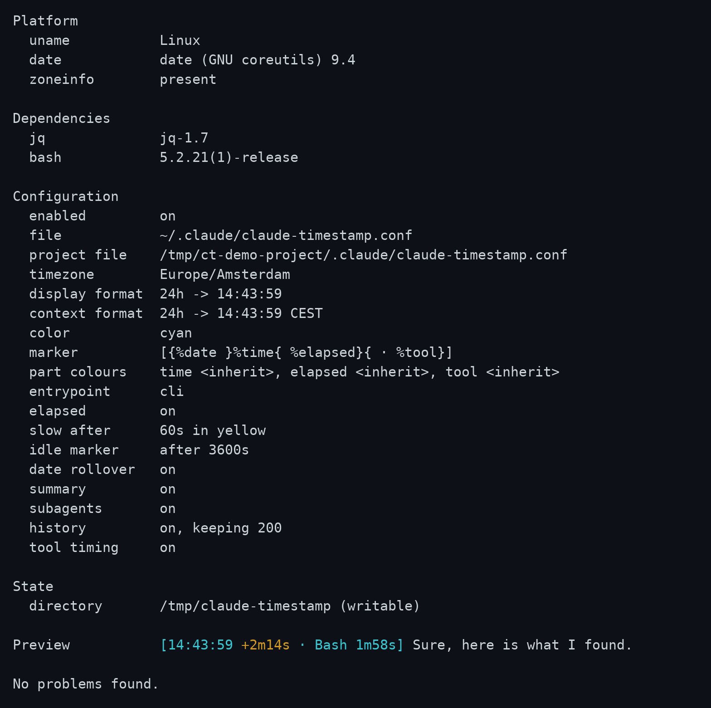

<div align="center">

# Claude Timestamp

**Every message stamped with the time it happened and how long it took.**
**At the end, where the session's time actually went.**

[](https://github.com/AraneaDev/claude-timestamp/releases)
[](https://aranea-development.nl/en/tools/claude-timestamp)
[](https://github.com/AraneaDev/claude-timestamp/actions/workflows/ci.yml)
[](tests/run.sh)
[](#platform-notes)
[](./LICENSE)


<sub>Two fast turns render dim. The third crosses the slow threshold, so its duration is coloured and, with `TOOL_TIMING` on, named after the tool that caused it. Tool timing is off by default, so a plain install will not show this on its own. This is a real session played back at real speed -- nothing here is sped up or looped faster than it happened.</sub>

</div>

---

A Claude Code plugin. It puts your local time on every assistant message, shows
how long each turn took, and tells Claude when your prompt was sent, so a long
conversation can be scanned, timed, and referred back to.

There is nothing to set up. The defaults work as soon as it is installed, and
`/timestamps` changes them from inside Claude Code without restarting anything.

## What it does

- **Timestamps every message.** A marker like `[13:22:13]` in front of each
  assistant message, in your local time or a timezone you pin.
- **Shows how long a turn took.** `+2m14s` counts from the moment you pressed
  enter to the moment the reply appeared.
- **Highlights slow turns.** Once a turn passes a threshold you set, its
  duration changes colour so you notice it instead of reading past it. Turn on
  `TOOL_TIMING` and it names what made the turn slow, too:
  `[13:22:13 +2m14s · Bash 1m58s]`.
- **Marks where you stepped away.** A gap between messages is labelled, so a
  session you returned to the next morning still reads in order.
- **Tells Claude the time.** The model receives the local time each prompt was
  sent, which lets it reason about when things happened. You can switch this
  off and keep the display-only marker.
- **Summarises the session.** On exit: how long it ran, how many turns, how
  much of that you spent waiting, and how much you were away. Waiting and away
  never cover the same seconds, so the two add up to no more than the session
  itself. Optionally which tools were slowest and how many calls failed.

```text
claude-timestamp: session lasted 1h30m over 12 turns, 24m18s of it waiting, 35m00s away.
slowest tools: Bash 41.2s (18 calls), WebFetch 8.1s (1 call), Read 2.0s (37 calls). 2 failed
```

The gap divider and that closing summary, in one screenshot -- the same session
this example is drawn from:

<p align="center">
  
</p>

- **Keeps a running record.** Finished sessions are logged so you can see where
  the time actually goes.

Display is display only. The marker is drawn as messages render, so it never
enters the transcript and never reaches the model.

## Requirements

`jq`, and `bash`. That is the whole list. If `jq` is missing the plugin says so
once and then does nothing, rather than failing quietly.

```text
macOS           brew install jq
Debian/Ubuntu   sudo apt-get install jq
Windows         winget install jqlang.jq
```

If you use Claude Code in WSL and the desktop app on Windows, those count as two
machines here and each needs its own copy. See [Windows: WSL and the desktop app
are separate installs](#windows-wsl-and-the-desktop-app-are-separate-installs).

## Install

```bash
claude plugin marketplace add https://aranea-development.nl/plugins/marketplace.json
claude plugin install claude-timestamp@aranea
```

Hooks are bound when a session starts, so start a new session before markers
appear. An already-running session will not pick the plugin up.

### If the install fails on port 22

Claude Code clones a plugin from its GitHub repository over SSH. On a machine
with no SSH key for GitHub, or with outbound port 22 blocked, the install stops
here:

```text
Failed to clone repository: ssh: connect to host github.com port 22: Connection timed out
fatal: Could not read from remote repository.
Please make sure you have the correct access rights and the repository exists.
```

The message points at access rights. This repository is public, so what failed
is the transport. Adding the marketplace succeeds either way, because that
clone uses HTTPS, which is why other plugins from the same marketplace install
on such a machine while this one does not.

Tell git to reach GitHub over HTTPS, then install again:

```bash
git config --global --add url."https://github.com/".insteadOf "git@github.com:"
git config --global --add url."https://github.com/".insteadOf "ssh://git@github.com/"
```

That rewrites outgoing GitHub SSH URLs and nothing else, so it takes nothing
away on a machine that could not use them in the first place. To undo it:

```bash
git config --global --unset-all url."https://github.com/".insteadOf
```

### Where it works

This is a Claude Code plugin, and it runs wherever Claude Code itself runs: the
terminal, the IDE extensions, and the **Code** tab of the desktop app. The
**Chat** and **Cowork** tabs are not Claude Code. They have no hooks and no
display event to attach a marker to, so nothing here can reach them. Cloud
sessions on the web read hooks from the repository and from managed settings
rather than from your `~/.claude`, so a personal install does not apply there
either.

### Windows: WSL and the desktop app are separate installs

Claude Code in WSL and the desktop app on Windows do not share a home directory.
WSL has `~/.claude`, Windows has `C:\Users\<you>\.claude`. Install the plugin
on one side and the other side has nothing installed, and the same goes for `jq`
and for the settings you picked with `/timestamps`. On macOS and Linux there is
one home directory, so one install covers everything.

Install both, on each side you actually use.

In WSL, on Debian or Ubuntu:

```bash
sudo apt-get install jq
claude plugin marketplace add https://aranea-development.nl/plugins/marketplace.json
claude plugin install claude-timestamp@aranea
```

On Windows:

```powershell
winget install jqlang.jq
claude plugin marketplace add https://aranea-development.nl/plugins/marketplace.json
claude plugin install claude-timestamp@aranea
```

The desktop app's plugin browser lists what your configured marketplaces
already offer and cannot add one, so the marketplace step is what makes the
plugin appear there at all. The commands above need the standalone CLI, which
is a separate installation from the desktop app. Without it, type the same two
steps as slash commands in a **Local** session in the Code tab, which needs
nothing else installed:

```text
/plugin marketplace add https://aranea-development.nl/plugins/marketplace.json
/plugin install claude-timestamp@aranea
```

Restart the desktop app after installing `jq`. It reads Windows user and system
environment variables when it launches and never reads your PowerShell profile,
so a `PATH` that winget changed underneath a running app does not reach it.
Until it does, every hook exits without drawing anything.

Pick **Local** for the session environment. Plugins do not load in the desktop
app's WSL sessions, which is Anthropic's limitation rather than this plugin's.
`bash` itself comes from Git for Windows, which the Code tab already requires.

## Configure

Nothing needs configuring. The defaults work, and the plugin tells you where to
change them on first run.

Run `/timestamps` inside Claude Code. Bare, it shows what you have now and
offers a handful of presets, each previewed as the marker it actually produces:

<p align="center">
  
</p>

It also takes the request directly, so `/timestamps tokyo`, `/timestamps no
colour` and `/timestamps 12 hour clock` each land in one step.

### The marker's layout

`MARKER` decides what the marker is made of and how it is arranged. The parts
are `%time`, `%elapsed`, `%tool` and `%date`, and a `{...}` group disappears
when every part inside it is empty:

Every line below was produced by running the renderer, not written by hand.
The first column is the setting, the second is what appears on screen.

```text
MARKER=                                          renders as

[{%date }%time{ %elapsed}{ · %tool}]             [13:22:13 +2m14s · Bash 1m58s]
[{%date }%time{ %elapsed}{ · %tool}]             [13:22:13]
   the default, on a turn with no duration and no tool

%time                                            13:22:13
%time{ %elapsed}                                 13:22:13 +2m14s
%time{ → %elapsed}                               13:22:13 → +2m14s
%time{ (%elapsed)}                               13:22:13 (+2m14s)
%time{ (%elapsed)}                               13:22:13
   the same template, on a turn with no duration

⟨%time⟩                                          ⟨13:22:13⟩
{%date }%time                                    Aug 21 13:22:13
%elapsed                                         +2m14s
[%time %elapsed]                                 [13:22:13]
   an empty part eats one run of spaces
```

**Groups matter when a part carries decoration.** `%time (%elapsed)` leaves an
empty pair of brackets behind on a turn with no duration. `%time{ (%elapsed)}`
does not, because the whole group goes when the part inside it is empty. Outside
a group, an empty part eats one run of spaces, which is why `[%time %elapsed]`
closes up on its own without needing a group at all.

**Groups do not nest.** A `{` inside a group makes the template invalid, and the
plugin falls back to the default and says so at the next session start. Flat
templates express nearly everything nesting would.

**A `%` that does not begin a part is literal**, so `100%` needs no escaping. A
`%` followed by letters must spell one of the four names exactly: `%elapsd` is
rejected as a typo rather than printed back at you, and `%timex` is rejected too
rather than quietly meaning `%time` followed by an `x`.

Same gallery, as a screenshot rather than a code block, with the per-part
colours from the next section shown on the last row:

<p align="center">
  
</p>

### Colour, and where it applies

Each part takes its own colour through `TIME_COLOR`, `ELAPSED_COLOR` and
`TOOL_COLOR`. An empty one follows `COLOR`, which is what "inherit" means in the
settings table. `SLOW_COLOR` still wins over `ELAPSED_COLOR` once a turn crosses
`SLOW_AFTER`, because a slow turn being obvious is the point of that setting.
`TIME_COLOR` colours both `%time` and `%date`, since the date is part of the
clock.

Colour is written as ANSI escape sequences, which only help where something
interprets them. A terminal does. Claude Code in VS Code, and other clients that
render the text as-is, do not, and an escape sequence sent there arrives as
visible `[2m` characters wrapped around the marker.

So the plugin sends colour only when it is running in a terminal session, and
sends plain text everywhere else. Nothing needs configuring: the marker simply
arrives clean in VS Code and coloured in a terminal.

Two environment variables override that, and both are read before anything else:

- **`NO_COLOR`**: never send colour, whatever `COLOR` says. Any non-empty value.
- **`FORCE_COLOR`**: send colour even outside a terminal, for a client you know renders it.

`NO_COLOR` wins when both are set. `setup.sh --doctor` reports which client it
detected and whether colour is being suppressed, which is the quickest way to
find out why a marker looks plainer than expected.

`ELAPSED` and `TOOL_TIMING` decide whether those parts have anything to say;
`MARKER` decides where they go. A part with nothing to say leaves no trace,
whichever of the two silenced it.

Changes take effect on your **next message**. Every hook reads the config file
each time it runs, so nothing needs restarting. Only installing the plugin
needs a new session, because that is when hooks are bound.

Nothing about this runs a shell script. `/timestamps` reads
`schema.json`, which ships with the plugin and describes every setting, and
edits your config file directly.

### From a terminal

If you would rather answer the questions yourself, the setup script has an
interactive wizard. It needs a real TTY, so run it in a terminal rather than
asking Claude to:

```bash
bash "$CLAUDE_PLUGIN_ROOT/hooks/scripts/setup.sh"
```

<p align="center">
  
</p>

Every question shows its current value in brackets, and pressing enter keeps
it. The colour list and the result line are rendered by the same code that
draws the real marker, so a preview cannot drift from what you will actually
see.

It also takes flags, so several settings can be set from a terminal in one call:

```bash
setup.sh --tz=Asia/Tokyo --display=short --color=dim --slow-after=30
```

Every flag is optional and anything you leave out keeps its current value.

### Project settings

A project can carry its own settings in `.claude/claude-timestamp.conf`,
layered over yours. Only the keys it names are overridden, so a repository can
pin one thing and leave the rest following your own configuration:

```bash
cd some-project
bash "$CLAUDE_PLUGIN_ROOT/hooks/scripts/setup.sh" --project --tz=UTC
```

That writes only `TZ=UTC`. Everything else still comes from your account. The
file is found by walking up from the directory the conversation is about, so it
applies from subdirectories too, and the search stops at your home directory so
your own config is never mistaken for a project one. For the same reason
`--project` refuses to run from your home directory: the file it would write
there is your account config, which no project layer would ever load.

The search also stops at the filesystem root, so a config directly in `/` is
not picked up, and after forty levels, which `--doctor` reports when it
happens.

Which files are in play is shown by `--doctor` and `--show`.

### Settings

Configuration lives in `~/.claude/claude-timestamp.conf` as `KEY=value`. It is
parsed against a list of known keys and never executed, so a stray line in it
cannot run anything.

| Setting | Default | What it does |
| --- | --- | --- |
| `ENABLED` | `on` | Master switch. `off` silences every hook without uninstalling it |
| `TZ` | machine local | IANA name such as `Europe/Amsterdam`, or empty for local time |
| `DISPLAY_FORMAT` | `24h` | `24h`, `short`, `12h`, `iso`, or any strftime string |
| `CONTEXT_FORMAT` | `24h` | Same values, for the time Claude is told |
| `COLOR` | `dim` | `none`, `dim`, `gray`, `red`, `green`, `yellow`, `blue`, `magenta`, `cyan` |
| `MARKER` | `[{%date }%time{ %elapsed}{ · %tool}]` | The marker's layout. `%time`, `%elapsed`, `%tool` and `%date` are the parts, a `{...}` group holds at least one part and disappears when every part inside it is empty, and groups do not nest |
| `TIME_COLOR` | inherit | Colour of `%time` and `%date`; empty follows `COLOR` |
| `ELAPSED_COLOR` | inherit | Colour of `%elapsed`; `SLOW_COLOR` still wins on a slow turn |
| `TOOL_COLOR` | inherit | Colour of `%tool`; empty follows `COLOR` |
| `ELAPSED` | `on` | Show how long the turn took |
| `INJECT_CONTEXT` | `true` | Tell Claude the local time each prompt was sent |
| `SLOW_AFTER` | `60` | Colour the duration past this many seconds, `0` disables |
| `SLOW_COLOR` | `yellow` | Colour used for a slow turn |
| `IDLE_AFTER` | `3600` | Mark a gap this long between messages, `0` disables |
| `DATE_ROLLOVER` | `on` | Show the date on the first message after midnight |
| `SUMMARY` | `on` | Report session totals on exit. Independent of `HISTORY`: both read the same counters, which are kept either way |
| `SUBAGENTS` | `on` | Stamp subagent messages as well |
| `TOOL_TIMING` | `off` | Record what each tool call cost and name the slowest |
| `HISTORY` | `on` | Record each finished session, for `/timestamps` and `--stats`. Independent of `SUMMARY` |
| `HISTORY_LIMIT` | `200` | How many recorded sessions to keep, 1 or more; `HISTORY=off` keeps none |
| `PROJECTS` | `off` | Record the project's directory name in each history row. Never a path, and off unless you turn it on |

Colour behaviour, including when it is suppressed and how `NO_COLOR` and
`FORCE_COLOR` override that, is covered above under **Colour, and where it
applies**.

A value the plugin cannot use is replaced by its default rather than silently
doing nothing, and it is named at the start of the next session and by
`--doctor`:

```text
claude-timestamp: some settings could not be used.
  COLOR=banana is not valid, using dim
  SLOW_AFTER=soon is not valid, using 60
Run /timestamps to fix them.
```

Clock formats render as `14:03:22` for `24h`, `14:03` for `short`, `2:03 PM`
for `12h`, and `2026-08-19T14:03:22` for `iso`. Any value containing a `%` is
treated as a strftime string, so the escape hatch needs no separate setting.

`TOOL_TIMING` is off by default because it is the only setting that costs
anything per tool call. Everything else costs once per message. Claude Code
reports how long each call took, so the plugin no longer times them itself,
but the hook that records the number still runs on every call.

Those timings cover the call alone. Time a permission prompt spent waiting for
you is not counted against the tool, so a slow turn you spent deciding through
will show its duration without naming a culprit.

Alongside the config, the plugin writes `~/.claude/claude-timestamp.facts.json`
at the start of every session. It holds what cannot be worked out by reading
the configuration: whether this machine has a timezone database, whether the
state directory is writable, and which version is installed. That is what lets
`/timestamps` answer questions about your setup without running anything.

## What the sessions add up to

Ask Claude how long you've been at this, or how much of it was waiting, and it
reads the totals straight out of `~/.claude/claude-timestamp-history.tsv` and
answers in the chat, no command needed.

For a terminal view, run the script instead:

```bash
bash "$CLAUDE_PLUGIN_ROOT/hooks/scripts/setup.sh" --stats
```

<p align="center">
  
</p>

Each finished session is appended to the history file, and the oldest are
dropped once there are more than `HISTORY_LIMIT` of them.

The file holds timings only: five numbers and a date per session. The date is
in whatever timezone you pinned, the same one the markers use, so a session you
watched happen on the 22nd is recorded on the 22nd. No message text, no tool
arguments, and no paths. With `PROJECTS=on` each row also carries the project's
directory name, never the path above it, and with `TOOL_TIMING=on` a list of
which tools took how long. Switch the record off entirely with `HISTORY=off`.

With those two settings on, the same file answers which project took the week
and which tool took the waiting:

```bash
bash "$CLAUDE_PLUGIN_ROOT/hooks/scripts/setup.sh" --stats --since=7d
bash "$CLAUDE_PLUGIN_ROOT/hooks/scripts/setup.sh" --stats --project=claude-timestamp
```

## When something is wrong

Ask Claude why you're not seeing timestamps and it reads the facts file and
your config against `schema.json` to tell you what it finds. The most common
cause is `ENABLED=off`, easy to set and forget since it silences every hook
without a trace on screen.

For a terminal check, run doctor instead:

```bash
bash "$CLAUDE_PLUGIN_ROOT/hooks/scripts/setup.sh" --doctor
```

<p align="center">
  
</p>

It checks that `jq` is present, that the config parses, that a pinned timezone
can actually be applied on this machine, and that the state directory is
writable, and exits non-zero if any of that fails. It also reports when this
client last drew a marker, which separates the two failures that look identical
from the outside: a plugin that never ran, and a plugin that drew a marker the
client then discarded. The first is an install to fix; the second is not
something any setting here can change. It also reports whether
`ENABLED` is on: switching the plugin off on purpose is not itself a problem,
so that line alone will not fail the check, but it is usually why you ran
doctor in the first place.

## How it works

Six scripts across eight events, all of them harness-only, so none of this
costs model context.

| Hook | Job |
| --- | --- |
| `SessionStart` | Check `jq`, prune old state, point a new user at `/timestamps` |
| `UserPromptSubmit` | Open the turn, close one an interrupt left behind, tell Claude the local time |
| `MessageDisplay` | Draw the marker on the first batch of each message |
| `Stop` / `StopFailure` | Close the turn and record what it cost |
| `SessionEnd` | Report the summary, record the session, clear its state |
| `PostToolUse` / `PostToolUseFailure` | Record what each tool call cost, only when `TOOL_TIMING=on` |

A turn is opened by the prompt that started it and closed by the event that
ended it, so what a turn cost is measured once rather than accumulated as its
messages arrive. A turn that ends in neither `Stop` nor `StopFailure`, which is
what an interrupt looks like from a hook, is closed by the next prompt using
the last message it drew.

`MessageDisplay` fires repeatedly as a message streams. Only the first batch is
stamped, and the rest return nothing at all, which Claude Code treats as "show
the original text". Returning the text unchanged would have meant a wasted
round trip on every batch of every message. The hook decides in the shell,
before `jq` or anything else forks, whether a batch needs stamping at all, so
a later batch costs nothing more than that one check.

Timing state lives in `$TMPDIR/claude-timestamp-<your uid>`, one small file per
session, cleared when the session ends and pruned after seven days. The
directory is created private to you, and one belonging to somebody else is
declined rather than written into.

## Platform notes

Tested on Linux, macOS and Windows on every push.

Git Bash on Windows ships without a timezone database. `date` there silently
falls back to UTC for any IANA name it cannot resolve, so a pinned zone would
show the wrong time and say nothing. The plugin detects this and uses local
time instead, mentions it once at session start, and refuses to write a pinned
zone it knows cannot be honoured. `UTC` and `GMT` still work, since those need
no database.

## Development

```bash
bash tests/run.sh                                    # 1109 assertions, no framework
shellcheck -S style -e SC1091 hooks/scripts/**/*.sh  # clean
bash tools/check-docs.sh                             # README against the code
```

The suite has no dependencies beyond what the plugin itself needs. Each case
resets the config and state directory before it runs, so no test can inherit
anything from the one before it. The interactive wizard is covered too: it
reads answers from stdin when there is no terminal, which makes the whole flow
scriptable without a pseudo-terminal.

Contributor setup, including the git hooks, is in
[CONTRIBUTING.md](CONTRIBUTING.md).

`tools/check-docs.sh` catches the ways this README goes stale without anyone
noticing: a setting that is added and never written down, an assertion count
that stops matching the suite, and an image link pointing at a file that has
been renamed.

CI runs on Linux, macOS and Windows. On macOS it runs the suite twice, once
with the default bash and once with `/bin/bash`, which is still 3.2. The
plugin claims to work there, and this is the only runner that can actually
check that claim.

### Screenshots

The images above are regenerated by a script rather than taken by hand:

```bash
bash tools/screenshots/make.sh          # all of them
bash tools/screenshots/make.sh doctor   # just one
```

It drives the real programs, then renders what was captured using a terminal
emulator. Hero, picker and wizard run through a pty, so the shot shows a real
terminal rather than a reconstruction; doctor, stats and markers capture plain
output instead, since none of them draw anything a pty would change; session
drives message-display.sh and session-end.sh directly with planted state, the
way tests/run.sh does. Nothing in those images is mocked up. Hero and picker
talk to an actual Claude Code session, so they need a working login and spend
tokens; wizard, doctor, stats, markers and session run local scripts only and
are free and offline. The hero shot's durations differ every run because they
are real measurements. Python dependencies install into a virtualenv beside
the script.

Every image is a lossless WebP, animation included: terminal captures are flat
colour with hard edges, which lossless compression suits far better than a
lossy setting would, at a fraction of the size PNG and GIF needed for the
same pixels.

## Releases

Versioned with [semantic versioning](https://semver.org) and released by
[release-please](https://github.com/googleapis/release-please), which reads the
commit messages. Commits follow
[conventional commits](https://www.conventionalcommits.org): `feat:`, `fix:`,
`docs:`, `test:`, `ci:`, `refactor:`, `chore:`.

While the version is below `1.0.0`, a feature bumps the patch number and a
breaking change bumps the minor one, so the shape of the configuration can
still settle without spending major versions on it.

Merging the Release PR tags the release as `v<version>` and updates
`plugin.json`, `version.txt`, the release manifest and the changelog together.
`tools/check-docs.sh` fails if those ever disagree, and the release workflow
checks the tag matches what it released.

Versions and tags are not hand-edited. See [CONTRIBUTING.md](CONTRIBUTING.md).

## License

MIT

---

Built by [Aranea Development](https://aranea-development.nl).
