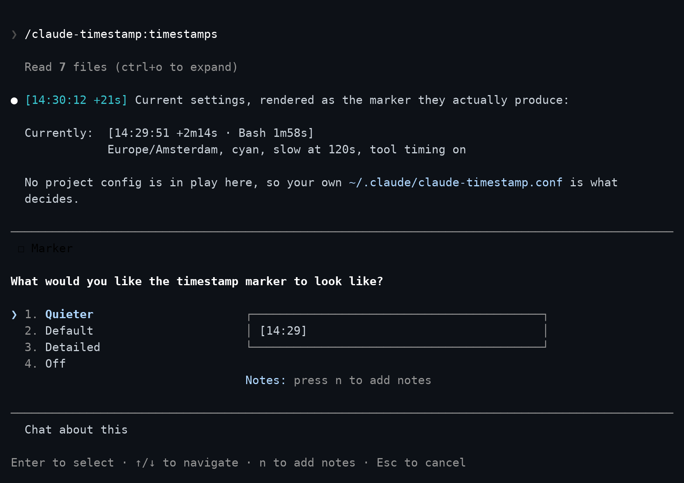
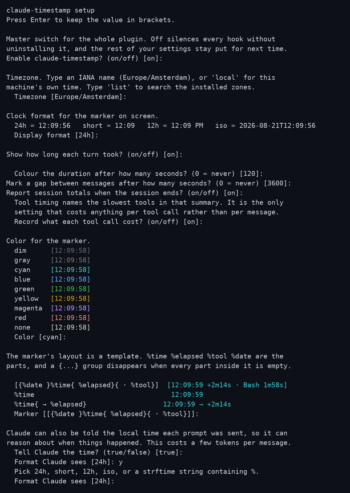
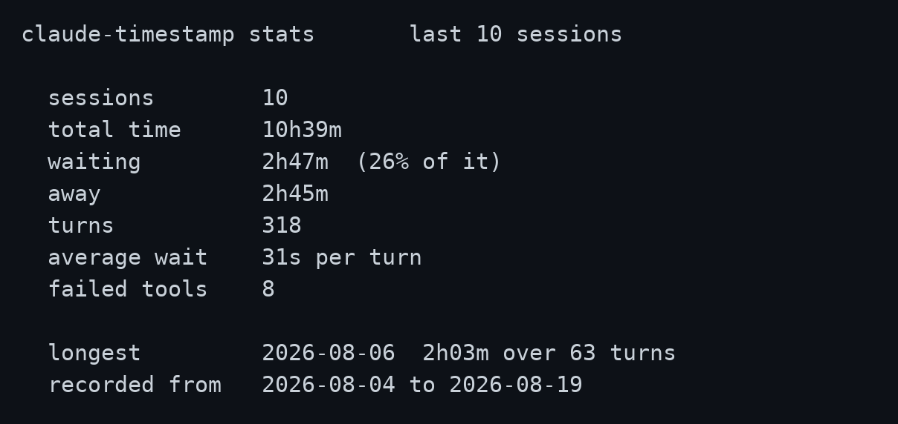
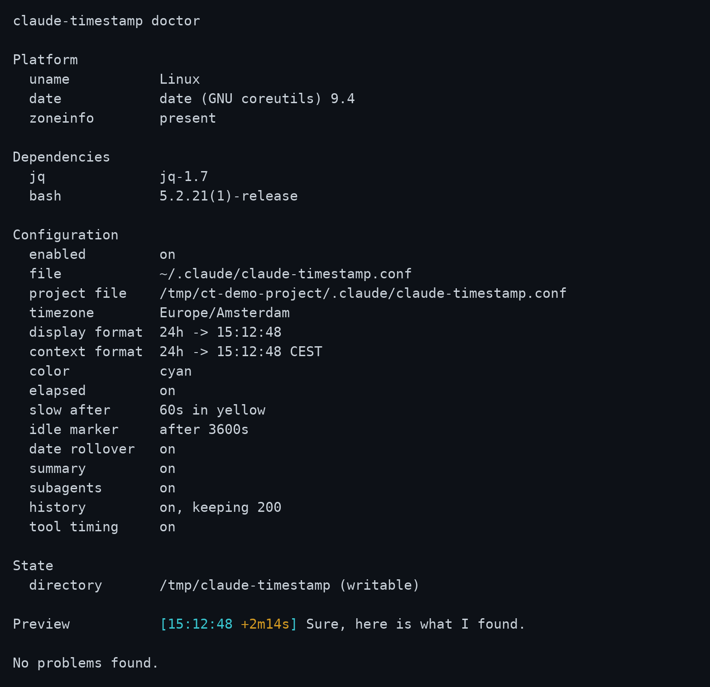

<div align="center">

# Claude Timestamp

**Every message stamped with the time it happened, and how long it took.**

[](https://github.com/AraneaDev/claude-timestamp/releases)
[](https://github.com/AraneaDev/claude-timestamp/actions/workflows/ci.yml)
[](tests/run.sh)
[](#platform-notes)
[](./LICENSE)


<sub>Two fast turns render dim. The third crosses the slow threshold, so its duration is coloured and, with `TOOL_TIMING` on, named after the tool that caused it. Tool timing is off by default, so a plain install will not show this on its own. This is a real session played back at real speed -- nothing here is sped up or looped faster than it happened.</sub>

</div>

---

A Claude Code plugin. It puts your local time on every assistant message, shows
how long each turn took, and tells Claude when your prompt was sent, so a long
conversation can be scanned, timed, and referred back to.

There is nothing to set up. The defaults work as soon as it is installed, and
`/timestamps` changes them from inside Claude Code without restarting anything.

## What it does

- **Timestamps every message.** A marker like `[13:22:13]` in front of each
  assistant message, in your local time or a timezone you pin.
- **Shows how long a turn took.** `+2m14s` counts from the moment you pressed
  enter to the moment the reply appeared.
- **Highlights slow turns.** Once a turn passes a threshold you set, its
  duration changes colour so you notice it instead of reading past it. Turn on
  `TOOL_TIMING` and it names what made the turn slow, too:
  `[13:22:13 +2m14s · Bash 1m58s]`.
- **Marks where you stepped away.** A gap between messages is labelled, so a
  session you returned to the next morning still reads in order.
- **Tells Claude the time.** The model receives the local time each prompt was
  sent, which lets it reason about when things happened. You can switch this
  off and keep the display-only marker.
- **Summarises the session.** On exit: how long it ran, how many turns, how
  much of that you spent waiting, and how much you were away. Optionally which
  tools were slowest and how many calls failed.

```
claude-timestamp: session lasted 1h30m over 12 turns, 24m18s of it waiting, 35m00s away.
slowest tools: Bash 41.2s (18 calls), WebFetch 8.1s (1 call), Read 2.0s (37 calls). 2 failed
```

- **Keeps a running record.** Finished sessions are logged so you can see where
  the time actually goes.

Display is display only. The marker is drawn as messages render, so it never
enters the transcript and never reaches the model.

## Requirements

`jq`, and `bash`. That is the whole list. If `jq` is missing the plugin says so
once and then does nothing, rather than failing quietly.

```
macOS           brew install jq
Debian/Ubuntu   sudo apt-get install jq
Windows         winget install jqlang.jq
```

## Install

```bash
claude plugin marketplace add AraneaDev/claude-timestamp
claude plugin install claude-timestamp@aranea-claude-tools
```

Hooks are bound when a session starts, so start a new session before markers
appear. An already-running session will not pick the plugin up.

## Configure

Nothing needs configuring. The defaults work, and the plugin tells you where to
change them on first run.

Run `/timestamps` inside Claude Code. Bare, it shows what you have now and
offers a handful of presets, each previewed as the marker it actually produces:

<p align="center">
  
</p>

It also takes the request directly, so `/timestamps tokyo`, `/timestamps no
colour` and `/timestamps 12 hour clock` each land in one step.

Changes take effect on your **next message**. Every hook reads the config file
each time it runs, so nothing needs restarting. Only installing the plugin
needs a new session, because that is when hooks are bound.

Nothing about this runs a shell script. `/timestamps` reads
`schema.json`, which ships with the plugin and describes every setting, and
edits your config file directly.

### From a terminal

If you would rather answer the questions yourself, the setup script has an
interactive wizard. It needs a real TTY, so run it in a terminal rather than
asking Claude to:

```bash
bash "$CLAUDE_PLUGIN_ROOT/hooks/scripts/setup.sh"
```

<p align="center">
  
</p>

Every question shows its current value in brackets, and pressing enter keeps
it. The colour list and the result line are rendered by the same code that
draws the real marker, so a preview cannot drift from what you will actually
see.

It also takes flags, so several settings can be set from a terminal in one call:

```bash
setup.sh --tz=Asia/Tokyo --display=short --color=dim --slow-after=30
```

Every flag is optional and anything you leave out keeps its current value.

### Project settings

A project can carry its own settings in `.claude/claude-timestamp.conf`,
layered over yours. Only the keys it names are overridden, so a repository can
pin one thing and leave the rest following your own configuration:

```bash
cd some-project
bash "$CLAUDE_PLUGIN_ROOT/hooks/scripts/setup.sh" --project --tz=UTC
```

That writes only `TZ=UTC`. Everything else still comes from your account. The
file is found by walking up from the directory the conversation is about, so it
applies from subdirectories too, and the search stops at your home directory so
your own config is never mistaken for a project one.

Which files are in play is shown by `--doctor` and `--show`.

### Settings

Configuration lives in `~/.claude/claude-timestamp.conf` as `KEY=value`. It is
parsed against a list of known keys and never executed, so a stray line in it
cannot run anything.

| Setting | Default | What it does |
| --- | --- | --- |
| `ENABLED` | `on` | Master switch. `off` silences every hook without uninstalling it |
| `TZ` | machine local | IANA name such as `Europe/Amsterdam`, or empty for local time |
| `DISPLAY_FORMAT` | `24h` | `24h`, `short`, `12h`, `iso`, or any strftime string |
| `CONTEXT_FORMAT` | `24h` | Same values, for the time Claude is told |
| `COLOR` | `dim` | `none`, `dim`, `gray`, `red`, `green`, `yellow`, `blue`, `magenta`, `cyan` |
| `ELAPSED` | `on` | Show how long the turn took |
| `INJECT_CONTEXT` | `true` | Tell Claude the local time each prompt was sent |
| `SLOW_AFTER` | `60` | Colour the duration past this many seconds, `0` disables |
| `SLOW_COLOR` | `yellow` | Colour used for a slow turn |
| `IDLE_AFTER` | `3600` | Mark a gap this long between messages, `0` disables |
| `DATE_ROLLOVER` | `on` | Show the date on the first message after midnight |
| `SUMMARY` | `on` | Report session totals on exit |
| `SUBAGENTS` | `on` | Stamp subagent messages as well |
| `TOOL_TIMING` | `off` | Time individual tool calls and name the slowest |
| `HISTORY` | `on` | Record each finished session, for `/timestamps` and `--stats` |
| `HISTORY_LIMIT` | `200` | How many recorded sessions to keep |

`NO_COLOR` disables colour regardless of `COLOR`.

A value the plugin cannot use is replaced by its default rather than silently
doing nothing, and it is named at the start of the next session and by
`--doctor`:

```
claude-timestamp: some settings could not be used.
  COLOR=banana is not valid, using dim
  SLOW_AFTER=soon is not valid, using 60
Run /timestamps to fix them.
```

Clock formats render as `14:03:22` for `24h`, `14:03` for `short`, `2:03 PM`
for `12h`, and `2026-08-19T14:03:22` for `iso`. Any value containing a `%` is
treated as a strftime string, so the escape hatch needs no separate setting.

`TOOL_TIMING` is off by default because it is the only setting that costs
anything per tool call. Everything else costs once per message.

Alongside the config, the plugin writes `~/.claude/claude-timestamp.facts.json`
at the start of every session. It holds what cannot be worked out by reading
the configuration: whether this machine has a timezone database, whether the
state directory is writable, and which version is installed. That is what lets
`/timestamps` answer questions about your setup without running anything.

## What the sessions add up to

Ask Claude how long you've been at this, or how much of it was waiting, and it
reads the totals straight out of `~/.claude/claude-timestamp-history.tsv` and
answers in the chat, no command needed.

For a terminal view, run the script instead:

```bash
bash "$CLAUDE_PLUGIN_ROOT/hooks/scripts/setup.sh" --stats
```

<p align="center">
  
</p>

Each finished session is appended to the history file, and the oldest are
dropped once there are more than `HISTORY_LIMIT` of them.

The file holds timings only: five numbers and a date per session. No message
text, no tool arguments, and no paths, so nothing in it says what you were
working on. Switch it off entirely with `HISTORY=off`.

## When something is wrong

Ask Claude why you're not seeing timestamps and it reads the facts file and
your config against `schema.json` to tell you what it finds. The most common
cause is `ENABLED=off`, easy to set and forget since it silences every hook
without a trace on screen.

For a terminal check, run doctor instead:

```bash
bash "$CLAUDE_PLUGIN_ROOT/hooks/scripts/setup.sh" --doctor
```

<p align="center">
  
</p>

It checks that `jq` is present, that the config parses, that a pinned timezone
can actually be applied on this machine, and that the state directory is
writable, and exits non-zero if any of that fails. It also reports whether
`ENABLED` is on: switching the plugin off on purpose is not itself a problem,
so that line alone will not fail the check, but it is usually why you ran
doctor in the first place.

## How it works

Seven hooks, all of them harness-only, so none of this costs model context.

| Hook | Job |
| --- | --- |
| `SessionStart` | Check `jq`, prune old state, point a new user at `/timestamps` |
| `UserPromptSubmit` | Record the turn start, tell Claude the local time |
| `MessageDisplay` | Draw the marker on the first batch of each message |
| `SessionEnd` | Report the summary, record the session, clear its state |
| `PreToolUse` / `PostToolUse` / `PostToolUseFailure` | Time tool calls and count failures, only when `TOOL_TIMING=on` |

`MessageDisplay` fires repeatedly as a message streams. Only the first batch is
stamped, and the rest return nothing at all, which Claude Code treats as "show
the original text". Returning the text unchanged would have meant a wasted
round trip on every batch of every message.

Timing state lives in `$TMPDIR/claude-timestamp`, one small file per session,
cleared when the session ends and pruned after seven days.

## Platform notes

Tested on Linux, macOS and Windows on every push.

Git Bash on Windows ships without a timezone database. `date` there silently
falls back to UTC for any IANA name it cannot resolve, so a pinned zone would
show the wrong time and say nothing. The plugin detects this and uses local
time instead, mentions it once at session start, and refuses to write a pinned
zone it knows cannot be honoured. `UTC` and `GMT` still work, since those need
no database.

Tool timings use sub-second precision where the shell provides it. That needs
bash 5 or newer. macOS still ships bash 3.2 as `/bin/bash`, and BSD `date` has
no `%N`, so there is no portable fallback. On those platforms durations round
to whole seconds and the call counts carry the signal.

## Development

```bash
bash tests/run.sh                                    # 334 assertions, no framework
shellcheck -S style -e SC1091 hooks/scripts/**/*.sh  # clean
bash tools/check-docs.sh                             # README against the code
```

The suite has no dependencies beyond what the plugin itself needs. Each case
resets the config and state directory before it runs, so no test can inherit
anything from the one before it. The interactive wizard is covered too: it
reads answers from stdin when there is no terminal, which makes the whole flow
scriptable without a pseudo-terminal.

Contributor setup, including the git hooks, is in
[CONTRIBUTING.md](CONTRIBUTING.md).

`tools/check-docs.sh` catches the ways this README goes stale without anyone
noticing: a setting that is added and never written down, an assertion count
that stops matching the suite, and an image link pointing at a file that has
been renamed.

CI runs on Linux, macOS and Windows. On macOS it runs the suite twice, once
with the default bash and once with `/bin/bash`, which is still 3.2. That is
what keeps the bash 3.2 claim above honest rather than aspirational.

### Screenshots

The images above are regenerated by a script rather than taken by hand:

```bash
bash tools/screenshots/make.sh          # all of them
bash tools/screenshots/make.sh doctor   # just one
```

It drives the real programs, then renders what was captured using a terminal
emulator. Hero, picker and wizard run through a pty, so the shot shows a real
terminal rather than a reconstruction; doctor and stats capture plain output
instead, since neither draws anything a pty would change. Nothing in those
images is mocked up. Hero and picker talk to an actual Claude Code session, so
they need a working login and spend tokens; wizard, doctor and stats run local
scripts only and are free and offline. The hero shot's durations differ every
run because they are real measurements. Python dependencies install into a
virtualenv beside the script.

## Releases

Versioned with [semantic versioning](https://semver.org) and released by
[release-please](https://github.com/googleapis/release-please), which reads the
commit messages. Commits follow
[conventional commits](https://www.conventionalcommits.org): `feat:`, `fix:`,
`docs:`, `test:`, `ci:`, `refactor:`, `chore:`.

While the version is below `1.0.0`, a feature bumps the patch number and a
breaking change bumps the minor one, so the shape of the configuration can
still settle without spending major versions on it.

Merging the Release PR tags the release as `v<version>` and updates
`plugin.json`, `version.txt`, the release manifest and the changelog together.
`tools/check-docs.sh` fails if those ever disagree, and the release workflow
checks the tag matches what it released.

Versions and tags are not hand-edited. See [CONTRIBUTING.md](CONTRIBUTING.md).

## License

MIT
