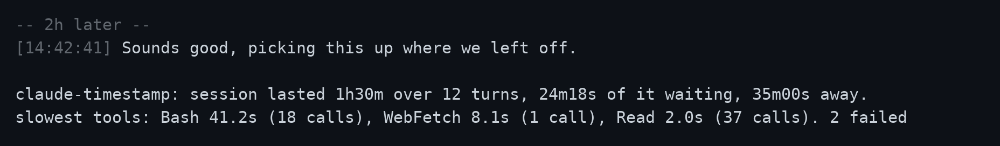
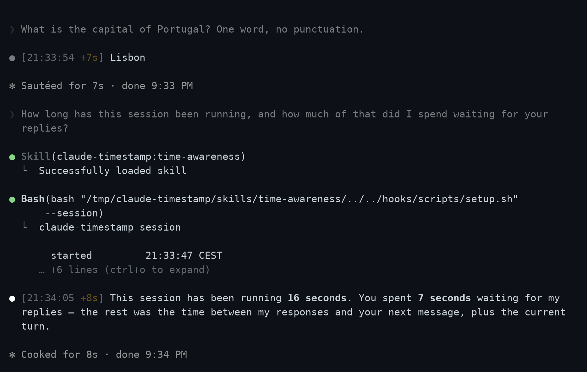
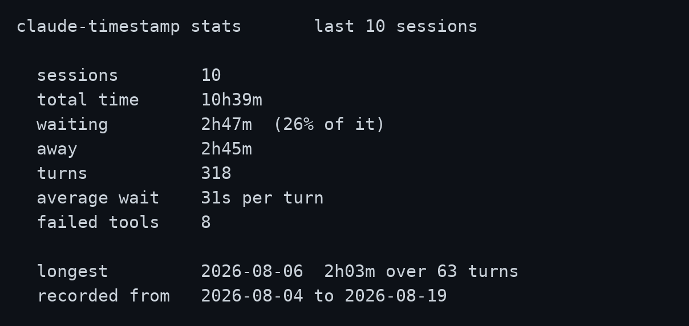

<div align="center">

# Claude Timestamp

**Time awareness for coding agents, in Claude Code and Codex.**

Every message stamped with the time it happened and how long it took.
The agent hears when a turn runs long, a command is slow, or work resumes after a gap.
At the end, where the session's time actually went.

[](https://github.com/AraneaDev/claude-timestamp/releases)
[](https://aranea-development.nl/en/tools/claude-timestamp)
[](https://github.com/AraneaDev/claude-timestamp/actions/workflows/ci.yml)
[](tests/run.sh)
[](docs/troubleshooting.md#platform-notes)
[](https://www.conventionalcommits.org/)
[](./LICENSE)


<sub>Two fast turns render dim. The third crosses the slow threshold, so its duration is coloured and, with `TOOL_TIMING` on, named after the tool that caused it. A real session, played back at real speed.</sub>

</div>

---

A coding agent has no clock. It cannot tell a two-minute turn from a
forty-minute one, does not know the test suite always takes four minutes, and
picks up yesterday's work as if no time had passed. Claude Timestamp gives it
that sense of time, and shows you the same numbers.

There is nothing to set up. The defaults work as soon as it is installed.

## What you get

### On your screen

Every assistant message carries the local time and how long the turn took, a
slow turn changes colour, and a gap between messages is marked, so a session
you return to the next morning still reads in order. On exit you get the
totals.

```text
claude-timestamp: session lasted 1h30m over 12 turns, 24m18s of it waiting, 35m00s away.
```

<p align="center">
  
</p>

### What the agent is told

The agent receives the time each prompt was sent, a short note when a turn
runs long or a tool call is slow, how long ago a project or conversation was
last active, and its own timeline after a compaction. A bundled skill tells it
what each note is a reason to do, and lets it answer "how long has this
session run?" from measurement. See [What Claude is told](docs/agent-notes.md).

<p align="center">
  
</p>

### What it learns

Every turn goes into a timeline, and every shell command into a memory of how
long it usually takes in this project. A new session starts with the slow ones
named, so the agent runs them in the background and waits for CI as long as CI
actually takes.

```text
Usually slow in this project: gh run watch ~7m40s (5 runs), bash tests/run.sh ~4m02s (12 runs).
That Bash call took 6m10s (usually 4m02s).
```

### Where your time went

Finished sessions are logged, and `--stats` adds them up: how long, how much of
it waiting and how much away, and, when you turn those on, per project and per
tool. See [Reports and history](docs/reports.md).

<p align="center">
  
</p>

## Install

It needs `bash` and `jq`.

**Claude Code**

```bash
claude plugin marketplace add https://aranea-development.nl/plugins/marketplace.json
claude plugin install claude-timestamp@aranea
```

Start a new session afterwards: hooks are bound when a session starts.

**Codex** installs it from a Codex-format marketplace that carries
`claude-timestamp`; the Claude Code feed above does not work there. See
[Install in Codex CLI](docs/install.md#install-in-codex-cli).

For installing `jq`, Windows with WSL and a blocked SSH port, see
[Install](docs/install.md).

## Works in

Claude Code in the terminal, the IDE extensions and the **Code** tab of the
desktop app, and Codex. What works depends on the client, not on the model.
Checked against Claude Code and Codex CLI 0.154.0.

| Feature | Claude Code | Codex | Note |
| --- | :---: | :---: | --- |
| Timestamp marker on each message | ✓ | ✗ | Codex has no event for drawing on a message |
| Idle divider and slow-turn colour | ✓ | ✗ | Drawn by the same marker |
| Prompt time told to Claude | ✓ | ✓ | |
| Turn-length and slow-tool notes | ✓ | ✓ | Codex timings are whole seconds |
| Resumption note, for a project or a conversation | ✓ | ✓ | |
| Note after a compaction | ✓ | ✓ | |
| Command memory and the usually-slow note | ✓ | ✓ | |
| Turn timeline, `--turns` | ✓ | ✓ | |
| A turn that ends in an API error recorded as `error` | ✓ | ✗ | Codex has no `StopFailure` event |
| Session summary at exit | ✓ | ✓ | Recorded in the history; `codex exec` does not display it |
| History and `--stats` | ✓ | ✓ | |
| `time-awareness` skill | ✓ | ✓ | |
| `/timestamps` command | ✓ | ✗ | Codex uses the `timestamps` skill or `setup.sh` |

The **Chat** and **Cowork** tabs of the desktop app are not Claude Code and
have no hooks, so nothing here reaches them.

## Configure

Run `/timestamps` in Claude Code to pick a timezone, a clock format, a colour
or a preset; it takes effect on the next message. Every setting, the marker's
layout, colours and per-project settings are in
[Configuration](docs/configuration.md).

## Documentation

- [Install](docs/install.md): requirements, both clients, Windows, a blocked SSH port.
- [Configuration](docs/configuration.md): `/timestamps`, the marker's layout, colours, every setting.
- [What Claude is told](docs/agent-notes.md): every note the agent receives, and the skill.
- [Reports and history](docs/reports.md): `--session`, `--turns`, `--commands`, `--stats`.
- [Troubleshooting](docs/troubleshooting.md): when something is wrong, platform notes.
- [How it works](docs/how-it-works.md): the hooks, what they cost, and why.
- [Contributing](CONTRIBUTING.md): setup, checks, screenshots, releases.

## Further reading

- [Your Claude Code session has no clock](https://tim-schipper.nl/en/blog/claude-code-timestamps)

## License

MIT

---

Built by [Tim Schipper](https://tim-schipper.nl/en) and released as open source under
[Aranea Development](https://aranea-development.nl).
