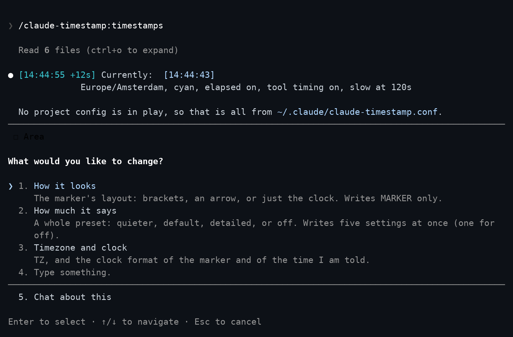
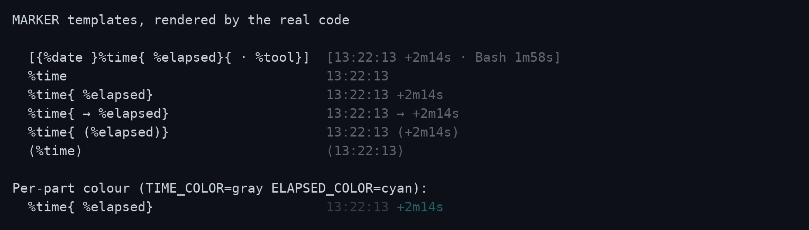
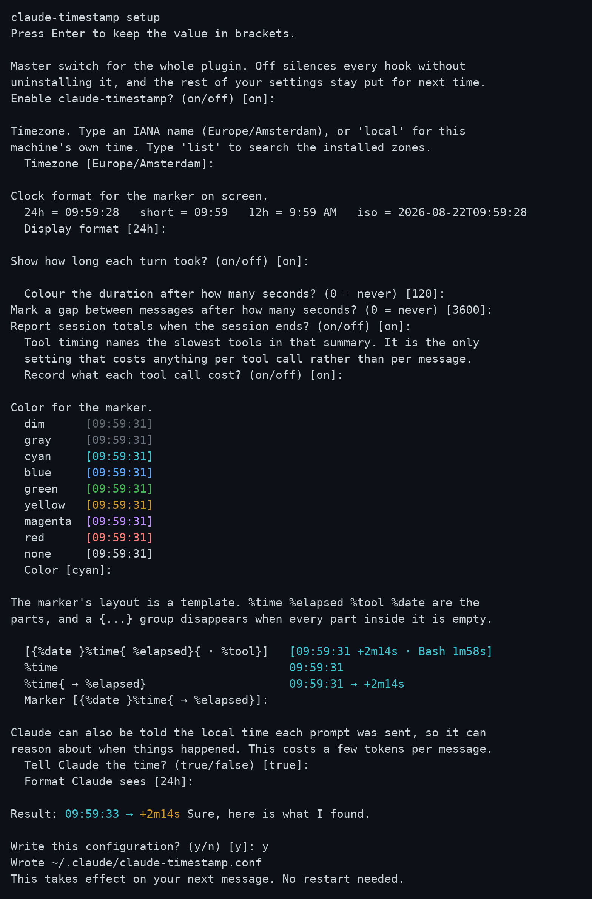

# Configuration

Part of the claude-timestamp documentation. Start at the [README](../README.md).

Nothing needs configuring. The defaults work, and the plugin tells you where to
change them on first run.

Run `/timestamps` inside Claude Code. Bare, it shows what you have now and
offers a handful of presets, each previewed as the marker it actually produces:

<p align="center">
  
</p>

It also takes the request directly, so `/timestamps tokyo`, `/timestamps no
colour` and `/timestamps 12 hour clock` each land in one step.

## The marker's layout

`MARKER` decides what the marker is made of and how it is arranged. The parts
are `%time`, `%elapsed`, `%tool` and `%date`, and a `{...}` group disappears
when every part inside it is empty:

Every line below was produced by running the renderer, not written by hand.
The first column is the setting, the second is what appears on screen.

```text
MARKER=                                          renders as

[{%date }%time{ %elapsed}{ · %tool}]             [13:22:13 +2m14s · Bash 1m58s]
[{%date }%time{ %elapsed}{ · %tool}]             [13:22:13]
   the default, on a turn with no duration and no tool

%time                                            13:22:13
%time{ %elapsed}                                 13:22:13 +2m14s
%time{ → %elapsed}                               13:22:13 → +2m14s
%time{ (%elapsed)}                               13:22:13 (+2m14s)
%time{ (%elapsed)}                               13:22:13
   the same template, on a turn with no duration

⟨%time⟩                                          ⟨13:22:13⟩
{%date }%time                                    Aug 21 13:22:13
%elapsed                                         +2m14s
[%time %elapsed]                                 [13:22:13]
   an empty part eats one run of spaces
```

**Groups matter when a part carries decoration.** `%time (%elapsed)` leaves an
empty pair of brackets behind on a turn with no duration. `%time{ (%elapsed)}`
does not, because the whole group goes when the part inside it is empty. Outside
a group, an empty part eats one run of spaces, which is why `[%time %elapsed]`
closes up on its own without needing a group at all.

**Groups do not nest.** A `{` inside a group makes the template invalid, and the
plugin falls back to the default and says so at the next session start. Flat
templates express nearly everything nesting would.

**A `%` that does not begin a part is literal**, so `100%` needs no escaping. A
`%` followed by letters must spell one of the four names exactly: `%elapsd` is
rejected as a typo rather than printed back at you, and `%timex` is rejected too
rather than quietly meaning `%time` followed by an `x`.

Same gallery, as a screenshot rather than a code block, with the per-part
colours from the next section shown on the last row:

<p align="center">
  
</p>

## Colour, and where it applies

Each part takes its own colour through `TIME_COLOR`, `ELAPSED_COLOR` and
`TOOL_COLOR`. An empty one follows `COLOR`, which is what "inherit" means in the
settings table. `SLOW_COLOR` still wins over `ELAPSED_COLOR` once a turn crosses
`SLOW_AFTER`, because a slow turn being obvious is the point of that setting.
`TIME_COLOR` colours both `%time` and `%date`, since the date is part of the
clock.

Colour is written as ANSI escape sequences, which only help where something
interprets them. A terminal does. Claude Code in VS Code, and other clients that
render the text as-is, do not, and an escape sequence sent there arrives as
visible `[2m` characters wrapped around the marker.

So the plugin sends colour only when it is running in a terminal session, and
sends plain text everywhere else. Nothing needs configuring: the marker simply
arrives clean in VS Code and coloured in a terminal.

Two environment variables override that, and both are read before anything else:

- **`NO_COLOR`**: never send colour, whatever `COLOR` says. Any non-empty value.
- **`FORCE_COLOR`**: send colour even outside a terminal, for a client you know renders it.

`NO_COLOR` wins when both are set. `setup.sh --doctor` reports which client it
detected and whether colour is being suppressed, which is the quickest way to
find out why a marker looks plainer than expected.

`ELAPSED` and `TOOL_TIMING` decide whether those parts have anything to say;
`MARKER` decides where they go. A part with nothing to say leaves no trace,
whichever of the two silenced it.

Changes take effect on your **next message**. Every hook reads the config file
each time it runs, so nothing needs restarting. Only installing the plugin
needs a new session, because that is when hooks are bound.

Nothing about this runs a shell script. `/timestamps` reads
`schema.json`, which ships with the plugin and describes every setting, and
edits your config file directly.

## From a terminal

If you would rather answer the questions yourself, the setup script has an
interactive wizard. It needs a real TTY, so run it in a terminal rather than
asking Claude to:

```bash
bash "$CLAUDE_PLUGIN_ROOT/hooks/scripts/setup.sh"
```

<p align="center">
  
</p>

Every question shows its current value in brackets, and pressing enter keeps
it. The colour list and the result line are rendered by the same code that
draws the real marker, so a preview cannot drift from what you will actually
see.

It also takes flags, so several settings can be set from a terminal in one call:

```bash
setup.sh --tz=Asia/Tokyo --display=short --color=dim --slow-after=30
```

Every flag is optional and anything you leave out keeps its current value.

## Project settings

A project can carry its own settings in `.claude/claude-timestamp.conf`,
layered over yours. Only the keys it names are overridden, so a repository can
pin one thing and leave the rest following your own configuration:

```bash
cd some-project
bash "$CLAUDE_PLUGIN_ROOT/hooks/scripts/setup.sh" --project --tz=UTC
```

That writes only `TZ=UTC`. Everything else still comes from your account. The
file is found by walking up from the directory the conversation is about, so it
applies from subdirectories too, and the search stops at your home directory so
your own config is never mistaken for a project one. For the same reason
`--project` refuses to run from your home directory: the file it would write
there is your account config, which no project layer would ever load.

The search also stops at the filesystem root, so a config directly in `/` is
not picked up, and after forty levels, which `--doctor` reports when it
happens.

Which files are in play is shown by `--doctor` and `--show`.

## Settings

Configuration lives in `~/.claude/claude-timestamp.conf` as `KEY=value`. It is
parsed against a list of known keys and never executed, so a stray line in it
cannot run anything.

| Setting | Default | What it does |
| --- | --- | --- |
| `ENABLED` | `on` | Master switch. `off` silences every hook without uninstalling it |
| `TZ` | machine local | IANA name such as `Europe/Amsterdam`, or empty for local time |
| `DISPLAY_FORMAT` | `24h` | `24h`, `short`, `12h`, `iso`, or any strftime string |
| `CONTEXT_FORMAT` | `24h` | Same values, for the time Claude is told |
| `COLOR` | `dim` | `none`, `dim`, `gray`, `red`, `green`, `yellow`, `blue`, `magenta`, `cyan` |
| `MARKER` | `[{%date }%time{ %elapsed}{ · %tool}]` | The marker's layout. `%time`, `%elapsed`, `%tool` and `%date` are the parts, a `{...}` group holds at least one part and disappears when every part inside it is empty, and groups do not nest |
| `TIME_COLOR` | inherit | Colour of `%time` and `%date`; empty follows `COLOR` |
| `ELAPSED_COLOR` | inherit | Colour of `%elapsed`; `SLOW_COLOR` still wins on a slow turn |
| `TOOL_COLOR` | inherit | Colour of `%tool`; empty follows `COLOR` |
| `ELAPSED` | `on` | Show how long the turn took |
| `INJECT_CONTEXT` | `true` | Tell Claude the local time each prompt was sent. `false` also silences the heartbeat, slow tool, slow commands, resumption and time-awareness pointer notes |
| `HEARTBEAT_AFTER` | `900` | Tell Claude how long the open turn has run, every this many seconds. `0` disables, and `INJECT_CONTEXT=false` silences it too |
| `SLOW_TOOL_AFTER` | `60` | Tell Claude when one tool call took at least this many seconds. `0` disables, and `INJECT_CONTEXT=false` silences it too |
| `RESUME_NOTE` | `on` | Tell Claude, when a session starts, how long ago this conversation or project was last active. `INJECT_CONTEXT=false` silences it too |
| `COMMAND_MEMORY` | `on` | Remember how long each Bash command takes in each project, by a short key such as `npm test`, and tell Claude at session start which are usually slow. `INJECT_CONTEXT=false` silences the note, not the recording |
| `SLOW_AFTER` | `60` | Colour the duration past this many seconds, `0` disables |
| `SLOW_COLOR` | `yellow` | Colour used for a slow turn |
| `IDLE_AFTER` | `3600` | Mark a gap this long between messages, `0` disables |
| `DATE_ROLLOVER` | `on` | Show the date on the first message after midnight |
| `SUMMARY` | `on` | Report session totals on exit. Independent of `HISTORY`: both read the same counters, which are kept either way |
| `SUBAGENTS` | `on` | Stamp subagent messages as well. Also decides whether a subagent is told about its own slow tool calls |
| `TOOL_TIMING` | `off` | Record what each tool call cost and name the slowest |
| `HISTORY` | `on` | Record each finished session, for `/timestamps` and `--stats`. Independent of `SUMMARY` |
| `HISTORY_LIMIT` | `200` | How many recorded sessions to keep, 1 or more; `HISTORY=off` keeps none |
| `PROJECTS` | `off` | Record the project's directory name in each history row. Never a path, and off unless you turn it on |

Colour behaviour, including when it is suppressed and how `NO_COLOR` and
`FORCE_COLOR` override that, is covered above under **Colour, and where it
applies**.

A value the plugin cannot use is replaced by its default rather than silently
doing nothing, and it is named at the start of the next session and by
`--doctor`:

```text
claude-timestamp: some settings could not be used.
  COLOR=banana is not valid, using dim
  SLOW_AFTER=soon is not valid, using 60
Run /timestamps to fix them.
```

Clock formats render as `14:03:22` for `24h`, `14:03` for `short`, `2:03 PM`
for `12h`, and `2026-08-19T14:03:22` for `iso`. Any value containing a `%` is
treated as a strftime string, so the escape hatch needs no separate setting.

Four settings cost something per tool call rather than once per message:
`TOOL_TIMING`, `HEARTBEAT_AFTER`, `SLOW_TOOL_AFTER` and `COMMAND_MEMORY`. While any of them is
on, a hook reads every tool call's payload to decide whether to record it or
tell Claude something. On the machine this was measured on, that came to a few
milliseconds per tool call (roughly 3 to 5 ms above the idle path). The two
notes and `COMMAND_MEMORY` are on by default and `TOOL_TIMING` is off. Setting
`HEARTBEAT_AFTER=0`, `SLOW_TOOL_AFTER=0`, `COMMAND_MEMORY=off` and
`TOOL_TIMING=off` together brings back the free path,
where the hook exits before it reads the payload. Claude Code reports how long
each call took, so the plugin no longer times them itself, but the hook that
records the number still runs on every call.

Those timings cover the call alone. Time a permission prompt spent waiting for
you is not counted against the tool, so a slow turn you spent deciding through
will show its duration without naming a culprit.

Alongside the config, the plugin writes `~/.claude/claude-timestamp.facts.json`
at the start of every session. It holds what cannot be worked out by reading
the configuration: whether this machine has a timezone database, whether the
state directory is writable, and which version is installed. That is what lets
`/timestamps` answer questions about your setup without running anything.
