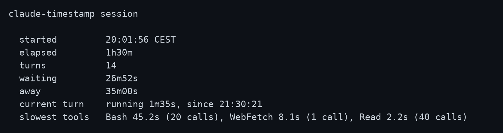

# What the sessions add up to

Part of the claude-timestamp documentation. Start at the [README](../README.md).

Ask Claude how long you've been at this, or how much of it was waiting, and it
answers in the chat, no command needed. The `time-awareness` skill runs one of
the two reports below and answers from its numbers: `--session` for the
session you are in, `--stats` for the ones already recorded.

For a terminal view, run the script instead:

```bash
bash "$CLAUDE_PLUGIN_ROOT/hooks/scripts/setup.sh" --stats
```

<p align="center">
  
</p>

Each finished session is appended to the history file, and the oldest are
dropped once there are more than `HISTORY_LIMIT` of them.

The file holds timings only: five numbers and a date per session. The date is
in whatever timezone you pinned, the same one the markers use, so a session you
watched happen on the 22nd is recorded on the 22nd. No message text, no tool
arguments, and no paths. With `PROJECTS=on` each row also carries the project's
directory name, never the path above it, and with `TOOL_TIMING=on` a list of
which tools took how long. Switch the record off entirely with `HISTORY=off`.

With those two settings on, the same file answers which project took the week
and which tool took the waiting:

```bash
bash "$CLAUDE_PLUGIN_ROOT/hooks/scripts/setup.sh" --stats --since=7d
bash "$CLAUDE_PLUGIN_ROOT/hooks/scripts/setup.sh" --stats --project=claude-timestamp
```

`--stats` only sees sessions that have already ended. For the one still
running, `--session` reports how long this session has run, from inside
Claude Code:

```bash
bash "$CLAUDE_PLUGIN_ROOT/hooks/scripts/setup.sh" --session
```

`--turns` lists the session one turn at a time: when each started, how long it
took, and, with `TOOL_TIMING` on, which tool took most of it. Add `--json` to
`--session` or `--turns` for the same data in a form a script, or Claude, can
read.

```bash
bash "$CLAUDE_PLUGIN_ROOT/hooks/scripts/setup.sh" --turns
bash "$CLAUDE_PLUGIN_ROOT/hooks/scripts/setup.sh" --session --json
```

`--commands` shows what the duration memory knows: how long each Bash command
usually takes in this project, from its last 20 runs. Commands are stored by
a short key, the program and at most two plain arguments (`npm test`,
`bash tests/run.sh`): never the full command line, quoted text, a flag, a URL,
a host, an absolute or home path, or anything `echo` and `printf` print. Long
token-shaped words are dropped too, but a short secret typed as a bare
argument can still end up in a key, so prefer an environment variable or a
file for those. The file is
`~/.claude/claude-timestamp-commands.tsv`; `COMMAND_MEMORY=off` stops
recording, and deleting the file forgets everything.

```bash
bash "$CLAUDE_PLUGIN_ROOT/hooks/scripts/setup.sh" --commands
bash "$CLAUDE_PLUGIN_ROOT/hooks/scripts/setup.sh" --commands --project=all
```

<p align="center">
  
</p>
