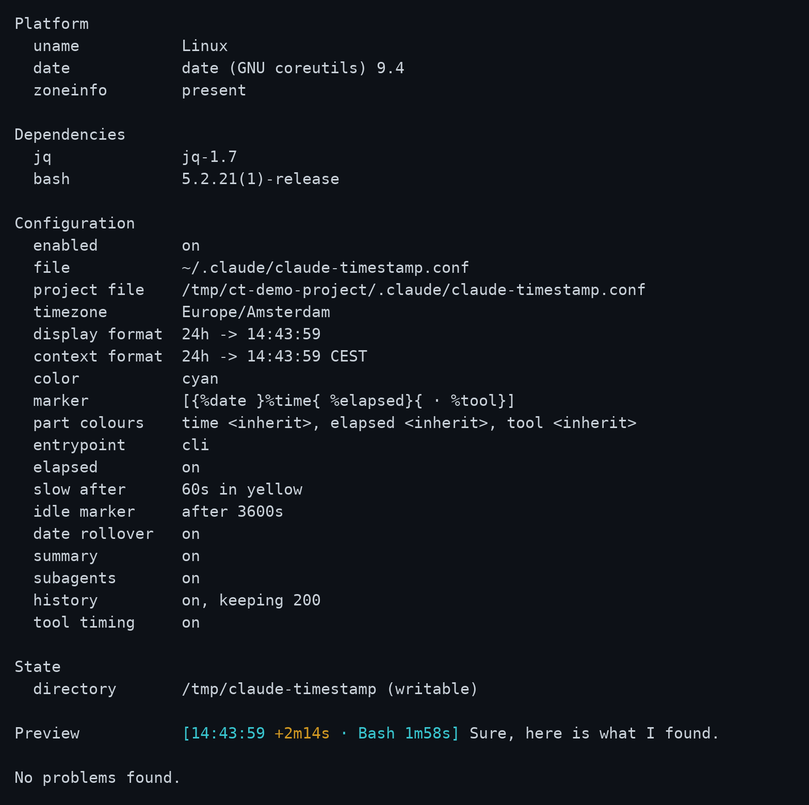

# Troubleshooting

Part of the claude-timestamp documentation. Start at the [README](../README.md).

## When something is wrong

Ask Claude why you're not seeing timestamps and it reads the facts file and
your config against `schema.json` to tell you what it finds. The most common
cause is `ENABLED=off`, easy to set and forget since it silences every hook
without a trace on screen.

For a terminal check, run doctor instead:

```bash
bash "$CLAUDE_PLUGIN_ROOT/hooks/scripts/setup.sh" --doctor
```

<p align="center">
  
</p>

It checks that `jq` is present, that the config parses, that a pinned timezone
can actually be applied on this machine, and that the state directory is
writable, and exits non-zero if any of that fails. It also reports when this
client last drew a marker. "Never" is expected until a message has been
displayed. After one has, it separates the two failures that look identical
from the outside: a plugin that never ran, and a plugin that drew a marker the
client then discarded. The first is an install to fix; the second is not
something any setting here can change. It also reports whether
`ENABLED` is on: switching the plugin off on purpose is not itself a problem,
so that line alone will not fail the check, but it is usually why you ran
doctor in the first place.

## Platform notes

Tested on Linux, macOS and Windows on every push.

Git Bash on Windows ships without a timezone database. `date` there silently
falls back to UTC for any IANA name it cannot resolve, so a pinned zone would
show the wrong time and say nothing. The plugin detects this and uses local
time instead, mentions it once at session start, and refuses to write a pinned
zone it knows cannot be honoured. `UTC` and `GMT` still work, since those need
no database.
